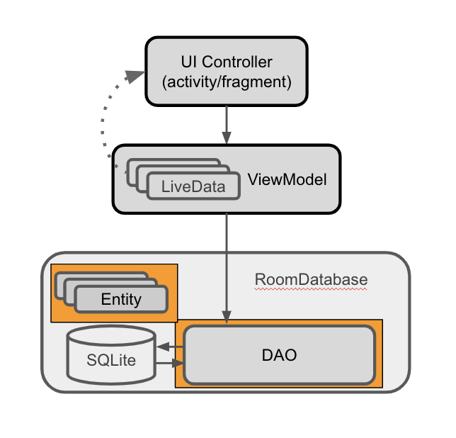

# TrackMySleepQuality
创建Room数据库

Introduction
------------
在此 Codelab 中，您将为一款用于跟踪睡眠质量的应用构建数据库部分。该应用使用数据库来存储一段时间的睡眠数据。

任务：创建 SleepNight 实体
------------
在 Android 中，数据用数据类表示。这种数据通过函数调用进行访问并可能会进行修改。不过，在数据库环境中，您需要通过实体和查询来访问及修改数据。

- 实体表示要在数据库中存储的对象或概念及其属性。在应用代码中，我们需要一个用于定义表的实体类，该类的每个实例都代表相应表中的一行。实体类以映射告知 Room 它打算如何呈现数据库中的信息并与之交互。在您的应用中，实体将保存有关一晚睡眠的信息。
- 查询是从一个数据库表或多个表的组合中获取数据或信息的请求，或对数据执行操作的请求。常见的查询用于创建、读取、更新和删除实体。例如，您可以通过执行查询来读取应用记录的所有睡眠时段，并按开始时间排序。
在本地持久保留一些数据对提升应用的用户体验（与其他常见用例类似）大有裨益。通过缓存相关数据块，用户即使处于离线状态，也可以享受您的应用带来的乐趣。如果您的应用依赖于服务器，缓存支持用户在离线时修改在本地持久保留的内容。应用恢复网络连接后，这些已缓存更改可以在后台无缝同步到服务器。

Room 会完成所有艰苦的工作，包括获取可存储在 SQLite 表中的 Kotlin 数据类和实体，以及获取函数声明和 SQL 查询。

您必须将每个实体定义为带注解的数据类；并将与该实体的交互定义为带注解的接口，称为“数据访问对象”(DAO)。Room 使用这些带注解的类在数据库中创建表，以及创建针对数据库的查询。

